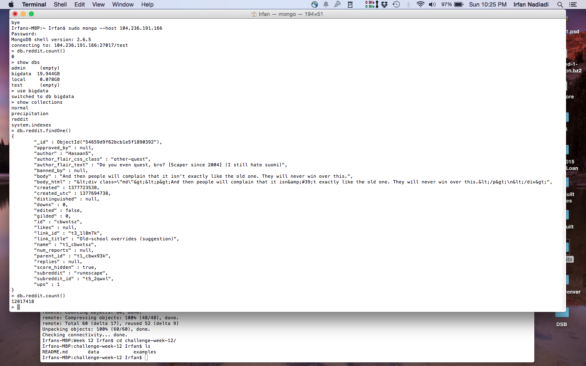
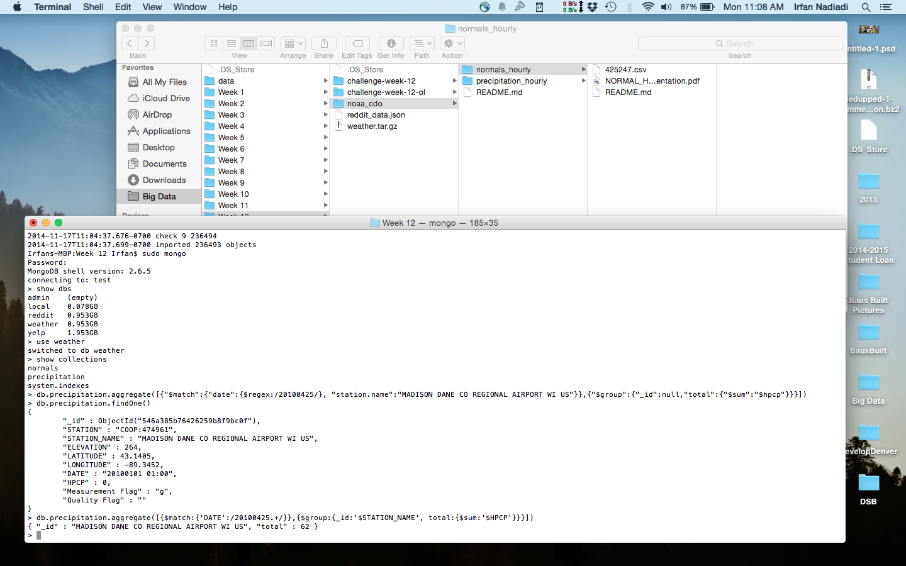
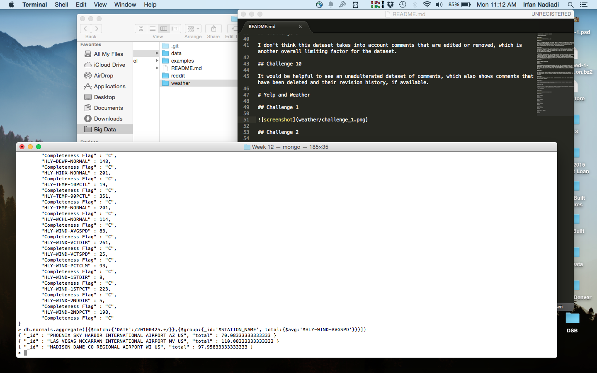

# Challenge Week 12 Submission Template

# Reddit Data Challenges

## Challenge 1

## Challenge 2

First, it's incredible how large this dataset really is, which is a testament to the popularity of reddit. The data provided is very granular and has more information than I expected, such as 'banned_by' and 'num_reports'.
Also, I may have done something incorrectly, but I'm finding that the comment with the most upvotes is by osufan765, with only 6 upvotes, which doesn't seem right...

## Challenge 3

Aggregating the data to show the summed 'upvote' scores by subreddit could help determine which subreddits are trending. It could also be interesting to see which comments are reported the most and if there are any common words among the body of the post that would indicate topics that the community finds unfavorable.

## Challenge 4

I think seeing the kind of posts that the Reddit community finds most unfavorable and favorable would give insight into the kinds of topics that users are most focused on. I use Reddit frequently, and I find that the overall behavior of users on the website is very predictable, and an analysis like this could help to quantify just how predictable (and possibly un-original) content on the website can really be.

## Challenge 5

[Link to Code or pasted code]
[Answer]

## Challenge 6

Finding commenters with more than 10 upvotes on their post does not necessarily reflect who is commenting the most. Popular posts on Reddit have hundreds, sometimes thousands of comments, and it is very easy for a post to get buried, never upvoted past 10. As a result, limiting the data to only those comments with greater than 10 upvotes would cut out a significant portion of the data.

## Challenge 7

Yes they would. The top 50 subreddits are likely to have many commenters, each commenting frequently, but the chances of those users having greater than 10 upvotes consistently is slim. The limited dataset would not accurately represent which users are commenting most in the top subreddits.

## Challenge 8

The top 50 subreddits are the most popular, so inherently there will be more people commenting there than other subreddits.

## Challenge 9

I don't think this dataset takes into account comments that are edited or removed, which is another overall limiting factor for the dataset.

## Challenge 10

It would be helpful to see an unadulterated dataset of comments, which also shows comments that have been deleted and their revision history, if available.

# Yelp and Weather 

## Challenge 1

## Challenge 2

db.normals.aggregate([{$match:{'DATE':/20100425.+/}},{$group:{_id:'$STATION_NAME', total:{$avg:'$HLY-WIND-AVGSPD'}}}])

110.083333

## Challenge 3

db.businesses.aggregate([{$match:{'city': 'Madison'}},{$group:{_id:0,total:{$sum:'$review_count'}}}])

34410

## Challenge 4

db.businesses.aggregate([{$match:{'city': 'Las Vegas'}},{$group:{_id:0,total:{$sum:'$review_count'}}}])

577550

## Challenge 5

db.businesses.aggregate([{$match:{'city': 'Phoenix'}},{$group:{_id:0,total:{$sum:'$review_count'}}}])

200089

## Challenge 6 [BONUS]

[Code]
[Answer]

